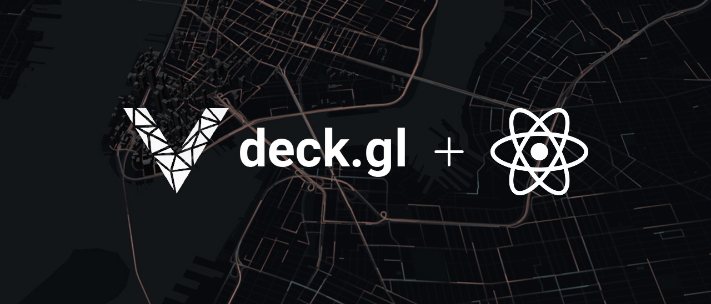

# Deckgl Fiber Renderer

A React renderer for [deck.gl](https://deck.gl/) that brings the full power of React to geospatial visualization.

Use deck.gl layers as React components with hooks, context, composition, and all the patterns you already know. No compromises.

> [!IMPORTANT]
> Requires React `19.0.0` and deck.gl `^9.1.0`

**[Get Started](#quick-start)** · **[Documentation](./packages/dom/README.md)** · **[Examples](#examples)**

---

## Why This Exists

The official deck.gl React bindings have significant limitations. This library removes them.

| Feature                 | Official Bindings                           | deckgl-fiber-renderer                              |
| ----------------------- | ------------------------------------------- | -------------------------------------------------- |
| **Component Nesting**   | ❌ Layers must be direct children only      | ✅ Nest layers anywhere in your tree               |
| **Hooks Support**       | ❌ Can't use hooks in layer components      | ✅ Full hooks support (useState, useContext, etc.) |
| **TypeScript Generics** | ❌ No type inference for accessor functions | ✅ Full generic support with autocomplete          |
| **Custom Layers**       | ⚠️ Requires registration                    | ✅ Works out of the box, no setup                  |
| **Code Splitting**      | ❌ Bundles all layers together              | ✅ Automatic tree-shaking                          |
| **Composition**         | ❌ Limited to DeckGL wrapper                | ✅ Use anywhere in React tree                      |

**The short version:** If you want to build deck.gl visualizations like you build React apps, this is for you.

---

## What It Looks Like

```tsx
import { ScatterplotLayer } from "@deck.gl/layers";
import { Deckgl } from "@deckgl-fiber-renderer/dom";

function MyMap() {
  // ✅ Use hooks anywhere
  const [radius, setRadius] = useState(100);
  const theme = useContext(ThemeContext);

  return (
    <Deckgl>
      {/* ✅ Nest layers in any component structure */}
      <layer
        layer={
          new ScatterplotLayer({
            id: "points",
            data: myData,
            getPosition: (d) => d.coordinates,
            getRadius: radius,
            getFillColor: theme.colors.primary,
          })
        }
      />
    </Deckgl>
  );
}
```

Layers update when your props change. The reconciler handles efficient diffing with deck.gl. You just write React.

---

## Features

- 🎯 **Full React Integration** - Hooks, context, suspense, concurrent features all work
- 🏗️ **Flexible Composition** - Render layers at any depth, wrap them in your components
- 🚀 **Automatic Code Splitting** - Only bundle the layers you import
- 📦 **Zero Configuration** - Custom layers work immediately, no registration
- 🔒 **Type Safe** - Full TypeScript support with generic type parameters
- ⚡ **Development Mode** - Helpful warnings for missing IDs and common mistakes
- 🗺️ **Multi-View Support** - Render Views as React components
- 🎨 **Basemap Integration** - Works with Mapbox, MapLibre via react-map-gl
- ♻️ **Automatic Cleanup** - Resources released when components unmount

No performance penalties - this is a thin reconciler layer over deck.gl's native API.

---

## Quick Start

### Install

```bash
npm install @deckgl-fiber-renderer/dom
```

Install peer dependencies:

```bash
npm install react react-dom @deck.gl/core @deck.gl/layers
```

### Basic Example

[TODO: Update after examples overhaul]

```tsx
import { ScatterplotLayer } from "@deck.gl/layers";
import { Deckgl } from "@deckgl-fiber-renderer/dom";
import { createRoot } from "react-dom/client";

const INITIAL_VIEW_STATE = {
  longitude: -122.45,
  latitude: 37.78,
  zoom: 12,
};

function App() {
  return (
    <Deckgl initialViewState={INITIAL_VIEW_STATE}>
      <layer
        layer={
          new ScatterplotLayer({
            id: "scatterplot",
            data: [
              { position: [-122.45, 37.78], size: 100 },
              { position: [-122.46, 37.79], size: 150 },
            ],
            getPosition: (d) => d.position,
            getRadius: (d) => d.size,
            getFillColor: [255, 140, 0],
          })
        }
      />
    </Deckgl>
  );
}

createRoot(document.getElementById("root")).render(<App />);
```

### With Basemap

[TODO: Update after examples overhaul]

```tsx
import { ScatterplotLayer } from "@deck.gl/layers";
import { Deckgl, useDeckgl } from "@deckgl-fiber-renderer/dom";
import { Map, useControl } from "react-map-gl/maplibre";

const MAP_STYLE = "https://tiles.basemaps.cartocdn.com/gl/dark-matter-gl-style/style.json";

function BasemapSync() {
  const deckgl = useDeckgl();
  useControl(() => deckgl);
  return null;
}

function App() {
  return (
    <Map mapStyle={MAP_STYLE}>
      <Deckgl interleaved>
        <BasemapSync />
        <layer
          layer={
            new ScatterplotLayer({
              id: "points",
              data: myData,
              getPosition: (d) => d.coordinates,
              getRadius: 100,
            })
          }
        />
      </Deckgl>
    </Map>
  );
}
```

**📖 For complete API documentation, patterns, and guides, see [packages/dom/README.md](./packages/dom/README.md)**

---

## Examples

Explore the examples to see different integration patterns:

**Getting Started:**

- [Standalone](https://github.com/deckgl-fiber-renderer/fiber.gl/tree/main/examples/standalone) - Basic setup without basemap
- [MapLibre Integration](https://github.com/deckgl-fiber-renderer/fiber.gl/tree/main/examples/react-map-gl) - Using react-map-gl
- [Migration Examples](https://github.com/deckgl-fiber-renderer/fiber.gl/tree/main/examples/migration) - Side-by-side v1 vs v2 syntax

**Framework Integration:**

- [Next.js](https://github.com/deckgl-fiber-renderer/fiber.gl/tree/main/examples/nextjs)
- [Remix/React Router](https://github.com/deckgl-fiber-renderer/fiber.gl/tree/main/examples/remix)
- [Vite](https://github.com/deckgl-fiber-renderer/fiber.gl/tree/main/examples/vite)
- [Rsbuild](https://github.com/deckgl-fiber-renderer/fiber.gl/tree/main/examples/rsbuild)

**Advanced:**

- [Custom Layers](https://github.com/deckgl-fiber-renderer/fiber.gl/tree/main/examples/custom-layer) - No registration needed!
- [Multiple Views](https://github.com/deckgl-fiber-renderer/fiber.gl/tree/main/examples/views) - Split-screen and minimap patterns
- [Widgets](https://github.com/deckgl-fiber-renderer/fiber.gl/tree/main/examples/widgets) - Integrating deck.gl widgets
- [Advanced with RSC](https://github.com/deckgl-fiber-renderer/fiber.gl/tree/main/examples/advanced) - React Server Components

Run any example:

```bash
pnpm --filter examples-<name> run dev
```

---

## Requirements

- **React:** `19.0.0` or higher
- **deck.gl:** `^9.1.0` (core and layer packages)
- **Modern bundler** with tree-shaking support (Vite, Next.js, Webpack 5+, Rsbuild, etc.)

---

## Contributing

Read the [contributing guidelines](CONTRIBUTING.md) if you're interested in contributing.

---

## Versioning

This project follows [Semantic Versioning](https://semver.org/).

**Current Status:** v2 is stable. The v1 syntax (layer-specific elements like `<scatterplotLayer>`) is deprecated and will be removed in v3.

---

## License

Licensed under the [MIT License](https://opensource.org/license/mit). See [LICENSE](LICENSE) for details.

---

## Acknowledgments

This project builds on the excellent work of:

- [deck.gl](https://github.com/visgl/deck.gl) - The foundational WebGL visualization framework
- [react-three-fiber](https://github.com/pmndrs/react-three-fiber) - Inspiration for the reconciler architecture
- [react-pdf](https://github.com/diegomura/react-pdf) - Additional reconciler patterns

Special thanks to the deck.gl team at Vis.gl and the wider geospatial visualization community.
